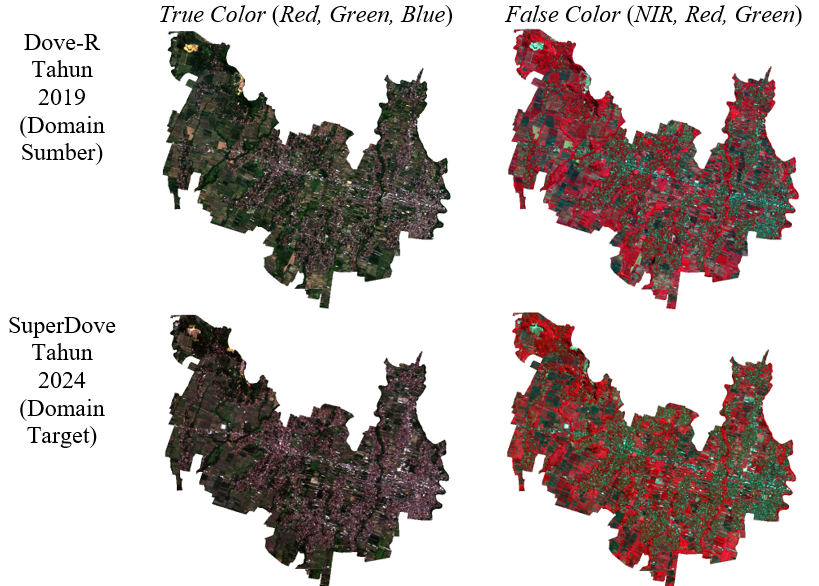
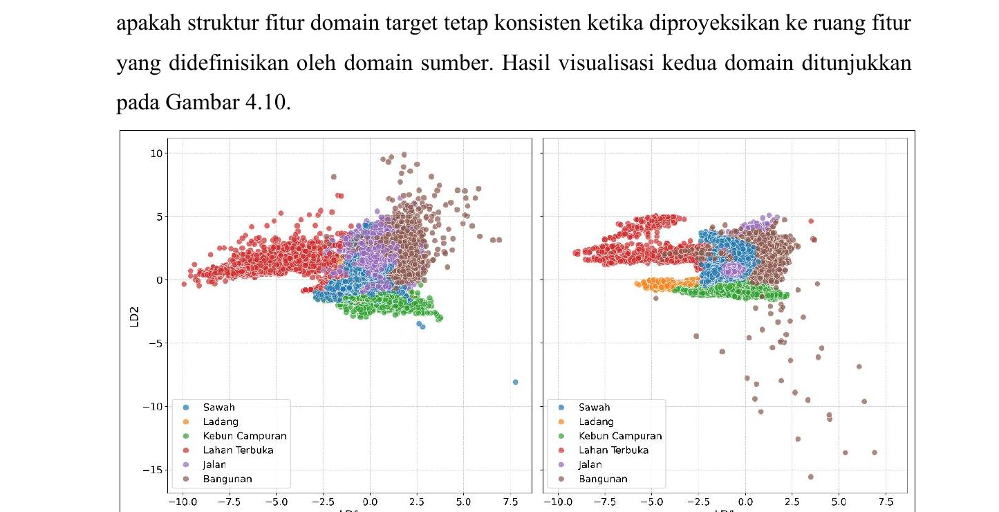
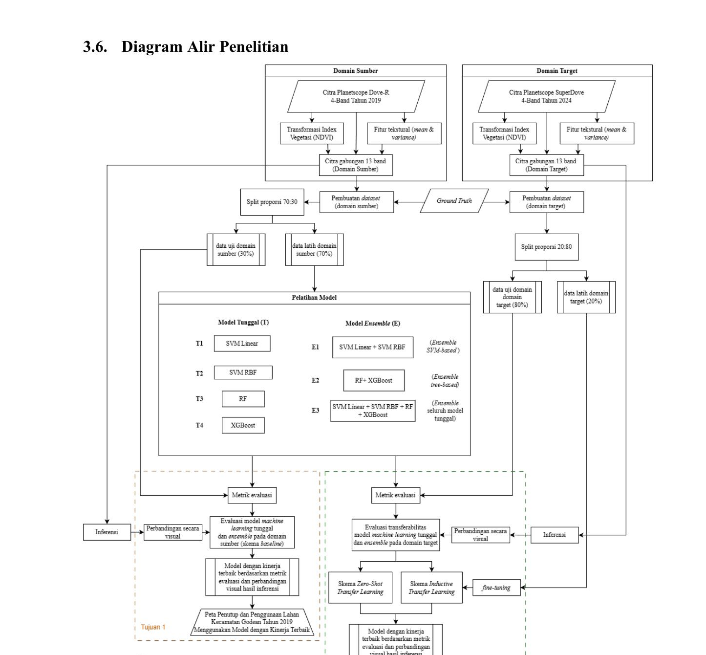
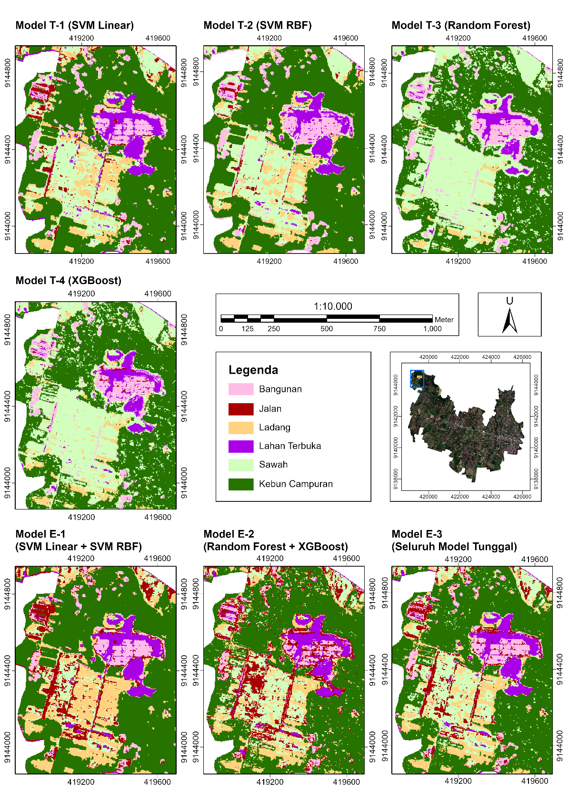

# Transfer Ensemble Learning for Large-Scale LULC Classification

**Undergraduate Thesis Cartography and Remote Sensing, Universitas Gadjah Mah**  
Godean Subdistrict, Sleman Regency, Yogyakarta · PlanetScope imagery · 2019 → 2024

📄 [Published thesis record (UGM Repository)](https://etd.repository.ugm.ac.id/penelitian/detail/269359)

---

## The Problem

Mapping land use and land cover (LULC) at large scale requires accurate, scalable classification methods. PlanetScope satellite imagery with its 3 m spatial resolution and daily revisit is well-suited for this task, but a practical challenge emerges: **models trained on one sensor generation fail when applied to a newer one.**

This study asked: *can a model trained on Dove-R imagery (2019) transfer its knowledge to SuperDove imagery (2024), and how much labeled data does it take to make that work?*

---

## Approach

Three evaluation schemes were tested against the same study area:

| Scheme | Description |
|---|---|
| **Baseline** | Train and test on source domain (Dove-R 2019) |
| **Zero-shot transfer** | Apply source-domain models directly to target domain (SuperDove 2024) no adaptation |
| **Inductive transfer (fine-tuning)** | Re-train source-domain models using a small labeled subset from the target domain |

Seven models were evaluated across all three schemes:

| Code | Model |
|---|---|
| T-1 | SVM (Linear kernel) |
| T-2 | SVM (RBF kernel) |
| T-3 | Random Forest |
| T-4 | XGBoost |
| E-1 | Stacking ensemble SVM-based |
| E-2 | Stacking ensemble tree-based (RF + XGBoost) |
| E-3 | Stacking ensemble all base models |

Input features: **4 spectral bands + NDVI + GLCM texture features** (mean & variance), 13 features total.  
LULC classes: Buildings, Roads, Dry Fields, Open Land, Paddies, Mixed Gardens.

---

## Imagery & Domain Shift

The core challenge is visible in the data itself. Dove-R (2019) and SuperDove (2024) differ in sensor characteristics, resulting in a measurable shift in spectral distribution across the same landscape.

*True color (RGB) and false color (NIR-R-G) composites. Note the visible difference in tone and contrast between the two sensors despite covering the same area.*

This domain shift is confirmed analytically via Linear Discriminant Analysis (LDA):

*LDA projects 13 features into 2 discriminant components. Class clusters in the source domain (left) shift and overlap in the target domain (right), explaining why zero-shot transfer fails.*

---

## Workflow

---

## Results

### Baseline (source domain, Dove-R 2019)

| Model | OA | F1-score | Inference time |
|---|---|---|---|
| T-1 SVM Linear | 0.7203 | 0.7956 | 28.7 min |
| T-2 SVM RBF | 0.8738 | 0.9002 | 75.4 min |
| T-3 Random Forest | 0.9211 | 0.9119 | 3.1 min |
| **T-4 XGBoost** | **0.9306** | **0.9316** | **4.2 min** |
| E-1 SVM ensemble | 0.8533 | 0.8920 | 114.0 min |
| E-2 Tree ensemble | 0.9235 | 0.9357 | 7.4 min |
| E-3 All models | 0.9205 | 0.9371 | 120.0 min |

Tree-based models (T-3, T-4, E-2) dominate strong accuracy with practical inference times.

### Zero-shot transfer (SuperDove 2024, no adaptation)

| Model | OA | F1-score |
|---|---|---|
| T-1 SVM Linear | 0.0496 | 0.2111 |
| T-2 SVM RBF | 0.3574 | 0.2662 |
| T-3 Random Forest | 0.5676 | 0.3299 |
| T-4 XGBoost | 0.5503 | 0.3203 |
| E-1 SVM ensemble | 0.1561 | 0.2841 |
| E-2 Tree ensemble | 0.5430 | 0.3840 |
| E-3 All models | 0.5326 | 0.4013 |

Performance collapses across the board. Even the best-performing zero-shot model (T-3, OA 0.57) is far below operational quality. The spectral distribution shift between sensor generations is enough to break all models.

*Visual comparison of zero-shot classification results across all 7 models. Class boundaries are unstable and highly noisy across the study area.*

### Inductive transfer fine-tuning (SuperDove 2024, with adaptation)

Fine-tuning used **20% of target-domain labeled samples** to re-adapt each model.

| Model | OA | F1-score | Inference time |
|---|---|---|---|
| T-1 SVM Linear | 0.7590 | 0.8204 | 6.2 min |
| T-2 SVM RBF | 0.8261 | 0.8635 | 24.6 min |
| T-3 Random Forest | 0.9010 | 0.8263 | 2.9 min |
| **T-4 XGBoost** | **0.9076** | **0.8715** | **3.5 min** |
| E-1 SVM ensemble | 0.6453 | 0.8234 | 36.4 min |
| E-2 Tree ensemble | 0.7891 | 0.8685 | 6.6 min |
| **E-3 All models** | 0.8065 | **0.8840** | 43.1 min |

Fine-tuning successfully recovers performance. T-4 (XGBoost) achieves the highest OA (0.9076) and E-3 produces the best F1-score (0.8840) with the smoothest spatial output. E-2 is the practical choice nearly matching E-3 in accuracy at a fraction of the inference time (6.6 vs 43.1 min).

*Classification results after fine-tuning. Spatial coherence is restored. T-4 and E-3 produce the cleanest outputs; E-2 offers a strong accuracy-efficiency tradeoff.*

---

## Key Findings

- **Tree-based models are robust to domain shift.** T-3 and T-4 consistently outperform SVM-based models across all three schemes, including under domain stress.
- **Zero-shot transfer is not viable** between Dove-R and SuperDove sensors domain shift is too large. Even a small fine-tuning subset (20% of target labels) is sufficient to restore near-source-domain performance.
- **E-2 is the practical optimum** when efficiency matters it approaches E-3's accuracy in a fraction of the inference time, in both baseline and fine-tuned settings.
- **E-3 is best when accuracy and spatial smoothness are the priority**, particularly in the transfer learning setting.

---

## Repository Contents

| File | Description |
|---|---|
| `0.preparation.ipynb` | Dataset preparation, cleaning, train-test splitting |
| `1.1.model_train.py` | Source-domain model training |
| `1.2.model_train(fine-tune).py` | Target-domain fine-tuning |
| `2.1model_evaluation.py` | Baseline and zero-shot evaluation |
| `2.2.model_evaluation(fine-tune).py` | Fine-tuned model evaluation |
| `3.1.model_inference.py` | Raster inference source-domain models |
| `3.2.model_inference(fine-tune).py` | Raster inference fine-tuned models |

> **Note:** Source imagery (PlanetScope), government-provided ground truth, intermediate raster products, trained model files, and output classification maps are not included due to file size and data redistribution restrictions. Geospatial preprocessing (NDVI generation, raster stacking, rasterization, sample extraction) was performed in ArcGIS Pro and QGIS prior to the Python ML workflow. This repository is maintained as a documented code archive.

---

## Stack

`Python` · `scikit-learn` · `XGBoost` · `rasterio` · `ArcGIS Pro` · `QGIS` · `Google Earth Engine`

---

## Author

**Waskita Abdillah Rafiqi**  
B.Sc. Cartography and Remote Sensing, Universitas Gadjah Mada, 3.30/4.00  
[LinkedIn](https://linkedin.com/in/waskita-abdillah-rafiqi) · [Published Thesis](https://etd.repository.ugm.ac.id/penelitian/detail/269359)
